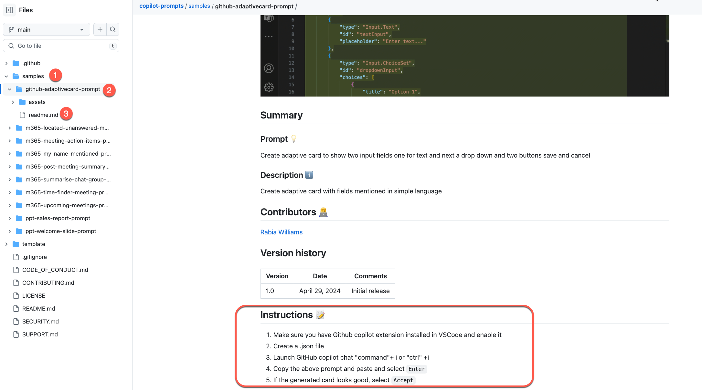

# Copilot prompts

This repository contains examples of prompts for Microsoft Copilot.

> We welcome community contributions to the `samples` folder in this repository for demonstrating different prompts for Microsoft Copilot. If you have a great sample prompt for Microsoft Copilot, GitHub Copilot or Microsoft Copilot for Microsoft 365, please share your work and help others!

> **Disclaimer:** The sample prompts provided in this repository are for demonstration purposes. They may not always be accurate or suitable for your specific use case. Please use them at your own discretion and review and modify them as necessary.By using the prompts in this repository, you acknowledge these limitations and agree to use the content responsibly. The authors of this repository or the prompts are not liable for any inaccuracies or issues that arise from the use of these prompts.

## Have an idea, issues or questions?

If you've got an idea or questions or experience an issue with any of the samples in this repo, please [create an issue](https://github.com/pnp/copilot-prompts/issues/new).

## Authors

This repository's contributors are all community members who volunteered their time to share code samples.

## How to use this repo

Simply go to the [samples](https://github.com/pnp/copilot-prompts/tree/main/samples) folder and select one sample (see steps 1-3) in the figure below. Then find the instructions in the readme.md file to run the prompt yourself. Be sure to checkout the prerequisites before you get started.

## Contributions

Samples in this repository are submitted by Microsoft's product groups, and the [Microsoft 365 and Power Platform community](http://aka.ms/m365pnp). We welcome your feedback and suggestions for new samples. We also welcome community contributions. If you have any questions, just let us know.

Please have a look on our [Contribution Guidance](./CONTRIBUTING.md) before submitting your pull requests, so that we can get your contribution processed as fast as possible. Create a pull request from your forked repos’ new branch to the upstream repository’s main branch so your prompts can be reviewed and approved by the one of the community folks in their free time.

Here is a detailed description to how you can contribute your own sample:

### Contributing your own prompts
Your insights can help the community thrive. If you have prompts that can benefit others or if you have figured out a hack, here’s how to share them:

#### Fork the repository
Go to the repository https://aka.ms/pnp-prompt-bank, select the Fork button to create your own copy.

#### Create a new branch
Clone your forked repository and create a new branch with a unique name that reflects your prompt’s purpose.

#### Add a new folder
Inside the samples folder, create a new folder following the naming convention: <apphost-functionality-prompt>.

For example, if you’re creating a prompt for a PowerPoint sales report, name it ppt-sales-report-prompt.

#### Prepare the readme file
Find an existing readme.md file in any sample folder.

Copy it into the new folder you created in the step above and update the contents in the file to describe your prompt.

#### Create an assets folder
Within your new folder, add a subfolder named assets. This is where you’ll store any images or GIF files that your readme file refers to.

#### Copy the sample JSON file
Locate the sample.json file in any existing sample’s assets folder. Copy this file into your own assets folder.

> Each of the samples in this repository will be shown in the [ M365 Solution Gallery page](https://adoption.microsoft.com/en-us/sample-solution-gallery/) for better discovery and use. The `sample.json` file is what helps feed the solution gallery website with the metadata of a sample.

#### Update the JSON file
Modify the sample.json file in your assets folder to match the details of your prompt.

And that’s it! You’re now ready to contribute your creative prompts to the repository.

## Code of Conduct

This repository has adopted the [Microsoft Open Source Code of Conduct](https://opensource.microsoft.com/codeofconduct/). For more information see the [Code of Conduct FAQ](https://opensource.microsoft.com/codeofconduct/faq/) or contact [opencode@microsoft.com](mailto:opencode@microsoft.com) with any additional questions or comments.

> Sharing is caring!

