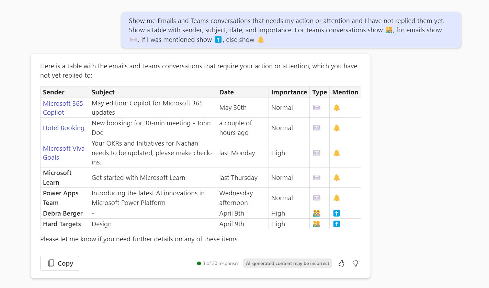

# 🚀 Track and manage pending communications on Emails and Teams conversations 📆

## Summary 📜

This is a prompt to list pending email and teams communications details along with sender, subject, date, importance, and mention. This prompt will ask Copilot to systematically track and manage pending communications (i.e., emails and Teams conversations), ensuring no important messages are overlooked. A detailed list of emails and Teams conversations that need the user's action.

## Prompt 💡

Show me Emails and Teams conversations that needs my action or attention and I have not replied them yet. Show a table with sender, subject, date, and importance. For Teams conversations show 👨‍👩‍👦‍👦, for emails show ✉️. If I was mentioned show ⬆️, else show 🔔.

## Description ℹ️

This prompt requests a list of pending email and Teams communication details, including the sender, subject, date, importance, and mentions. The purpose is to have Copilot systematically track and manage pending communications, ensuring no important messages are missed. It generates a detailed list of emails and Teams conversations that require the user's attention.

## Contributors 👨‍💻

[Nanddeep Nachan](https://github.com/nanddeepn)

## Version history 📋

Version|Date|Comments
-------|----|--------
1.0|June 14, 2024|Initial release

## Instructions 📝

1. Make sure you have copilot for Microsoft 365 in your tenant
2. Go to Copilot app in Teams
3. Copy paste the above prompt
4. IF you want, you can also modify the prompt to show the list of meetings for next week or for a specific date range

### Improvise Usage 🚀

You can add more information to the prompt if needed to show details in the table. You can modify the meeting dates / range  in the prompt so that you can get the details of the meeting for the range which you are looking for. Currently, the prompt is showing the details of the meeting for the current week.

## Prerequisites 📦

* [Copilot for Microsoft 365](https://developer.microsoft.com/microsoft-365/dev-program)

## Help 💁

We do not support samples, but this community is always willing to help, and we want to improve these samples. We use GitHub to track issues, which makes it easy for  community members to volunteer their time and help resolve issues.

You can try looking at [issues related to this sample](https://github.com/pnp/copilot-prompts/issues?q=label%3A%22sample%3A%20YOUR-SAMPLE-NAME%22) to see if anybody else is having the same issues.

If you encounter any issues using this sample, [create a new issue](https://github.com/pnp/copilot-prompts/issues/new).

Finally, if you have an idea for improvement, [make a suggestion](https://github.com/pnp/copilot-prompts/issues/new).

## Disclaimer

**THIS CODE IS PROVIDED *AS IS* WITHOUT WARRANTY OF ANY KIND, EITHER EXPRESS OR IMPLIED, INCLUDING ANY IMPLIED WARRANTIES OF FITNESS FOR A PARTICULAR PURPOSE, MERCHANTABILITY, OR NON-INFRINGEMENT.**

