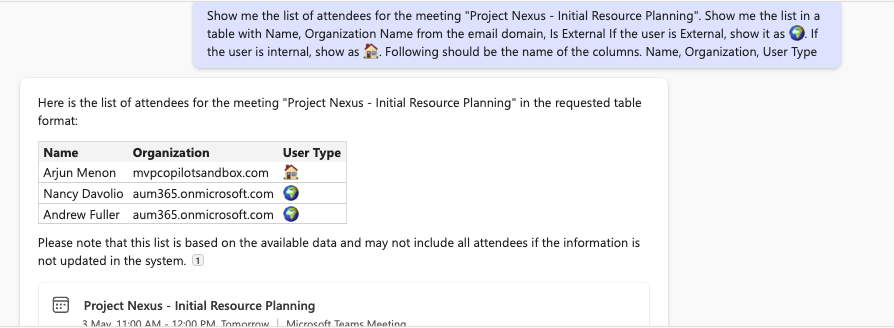

# 🚀 List meeting invitees for a meeting distinguishing internal and external invitees 👩🏽‍🦰👱🏽‍♂️

## Summary 📜

This is a prompt to list the attendees for a meeting. It will show the list of invitees in a tabular format with the Name, Organization Name  and User Type; whether the user is internal or external.

## Prompt 💡

Show me the list of attendees for the meeting [meetingname]. Show me the list in a table with Name, Organization Name from the email domain, Is External
If the user is External, show it as 🌍. If the user is internal, show as 🏠.
Following should be the name of the columns.
Name, Organization, User Type

## Description ℹ️

Copilot will show the list of invitees for the meeting in a tabular format. It will show the name of the invitee, the organization name from the email domain, User Type; whether the user is internal or external. If the user is external / guest, it will show a 🌍, and if the user is internal, it will show a 🏠 emoji.

## Contributors 👨‍💻

[Arjun Menon](https://github.com/arjunumenon)

## Version history 📋

Version|Date|Comments
-------|----|--------
1.0|May 02, 2024|Initial release

## Instructions 📝

1. Make sure you have copilot for Microsoft 365 in your tenant
2. Go to Copilot app in Teams
3. Copy paste the above prompt
4. Replace the [meetingname] with your meeting. You can also use Copilot app's reference inserting feature.

### Improvise Usage 🚀

You can add more information to the prompt if needed to show details in the table. You can also modify the prompt to mention the invitees as External / Internal rather than showing emojis.

## Prerequisites 📦

* [Copilot for Microsoft 365](https://developer.microsoft.com/microsoft-365/dev-program)

## Help 💁

We do not support samples, but this community is always willing to help, and we want to improve these samples. We use GitHub to track issues, which makes it easy for  community members to volunteer their time and help resolve issues.

You can try looking at [issues related to this sample](https://github.com/pnp/copilot-prompts/issues?q=label%3A%22sample%3A%20YOUR-SAMPLE-NAME%22) to see if anybody else is having the same issues.

If you encounter any issues using this sample, [create a new issue](https://github.com/pnp/copilot-prompts/issues/new).

Finally, if you have an idea for improvement, [make a suggestion](https://github.com/pnp/copilot-prompts/issues/new).

## Disclaimer

**THIS CODE IS PROVIDED *AS IS* WITHOUT WARRANTY OF ANY KIND, EITHER EXPRESS OR IMPLIED, INCLUDING ANY IMPLIED WARRANTIES OF FITNESS FOR A PARTICULAR PURPOSE, MERCHANTABILITY, OR NON-INFRINGEMENT.**

